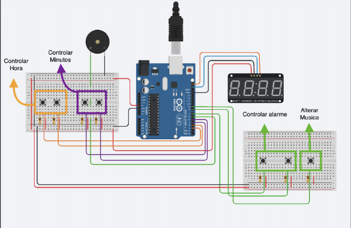

## Relógio Digital

> Atividade avaliativa A3

Neste projeto foi criado um relógio digital com display de 7 segmentos. O relógio feito em arduino possui botões que controlam as horas, minutos e também definem um alarme.
O arduino Uno R3 possui 6 pinos de entradas analógicas, 14 entradas e saídas digitais, 6 podem ser usadas como PWM. Para implementar a lógica do relógio, identificamos que a linguagem é próxima do C++.

---
Preview do hardware/montagem:

---
Preview do funcionamento:

## 🛠️ Tecnologias e ferramentas
(principais utilizadas)

- Arduino
- tinkercad

---

# Link
> [Relogio Digital tinkercadf](https://www.tinkercad.com/things/56Xygg0lGcy-cool-rottis/editel?returnTo=%2Fdashboard%3Ftype%3Dcircuits%26collection%3Dprojects%26id%3D6ha67qF31g4&sharecode=L6iIRyOHFaEiB1-Xh6bRU2-0U21b02C1kb3VhbW_iGw)

# Contatos 📧 
matheusilva334@gmail.com